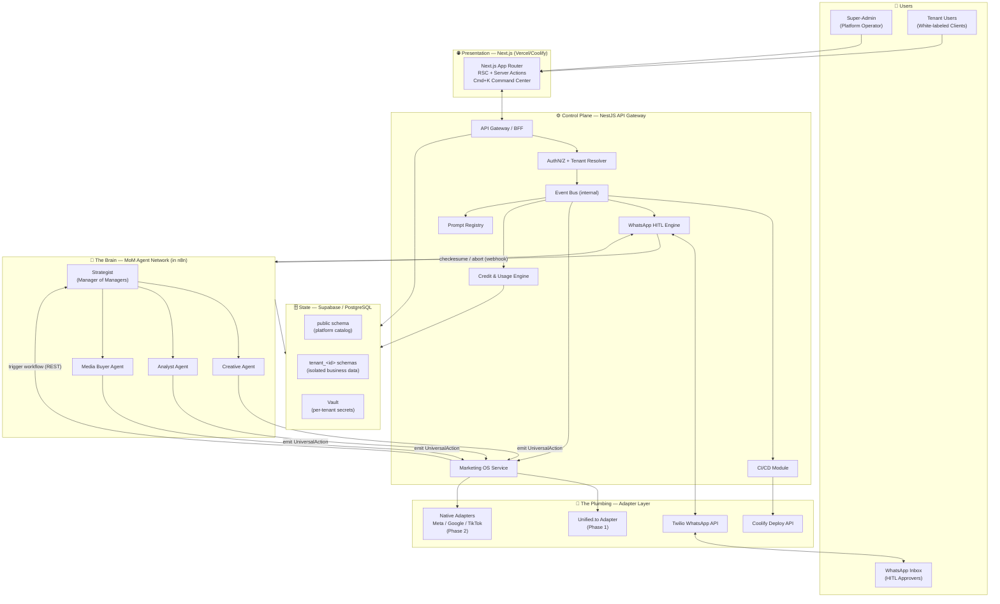
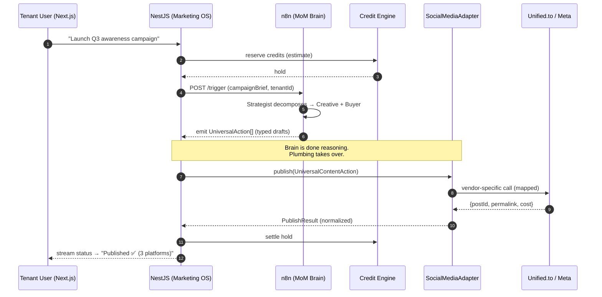
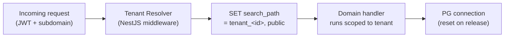
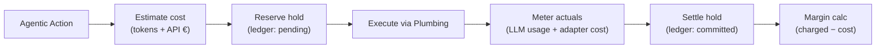
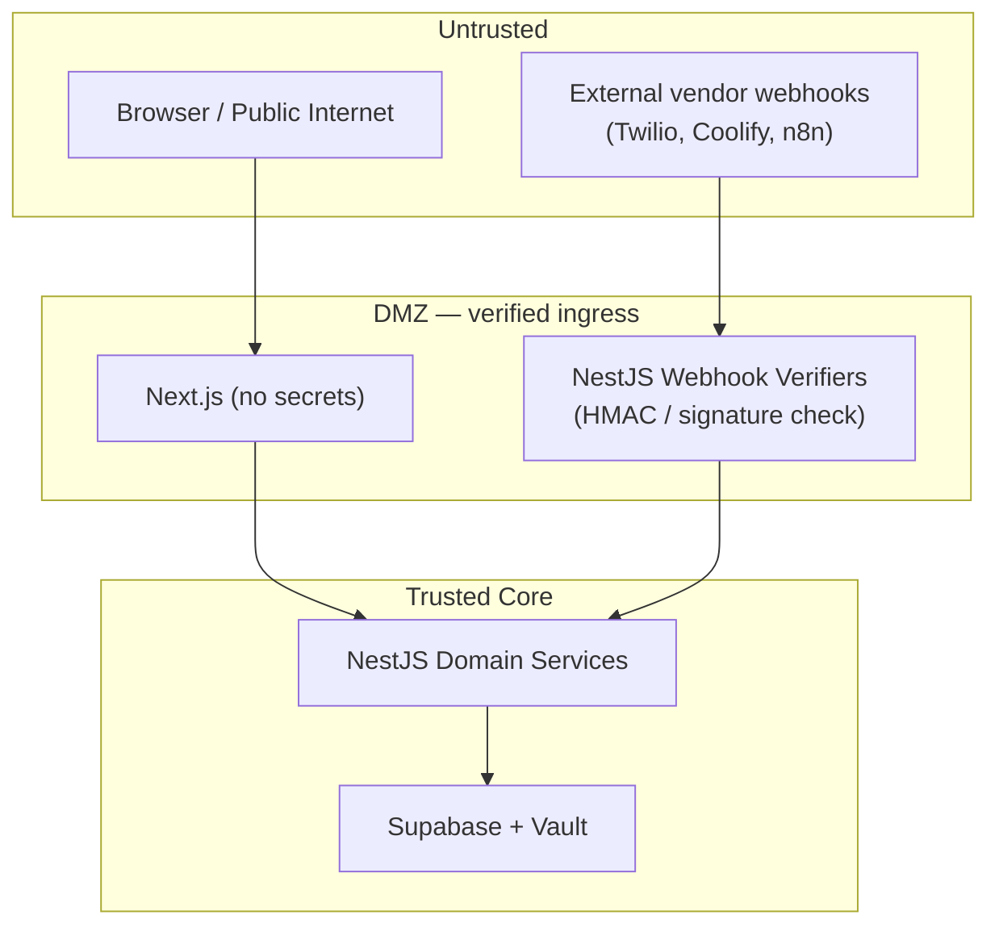
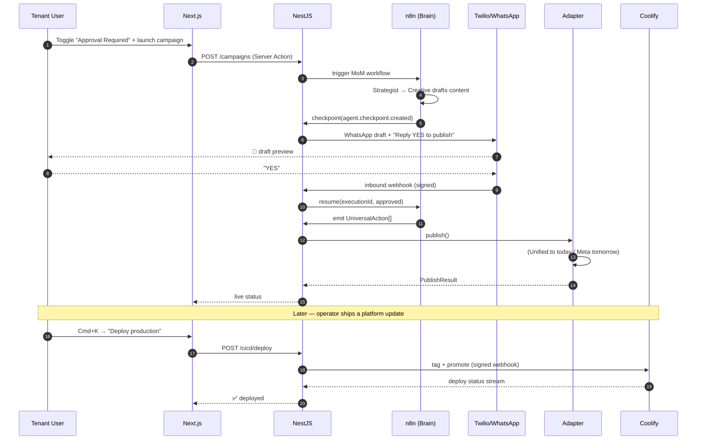

# Phase 0 — The Skeleton View

**Praxarch System Architecture Blueprint**
*Version 0.1 · Status: Foundational*

This document is the single source of truth for how Praxarch's components fit together. It maps the interaction between Next.js, NestJS, Supabase, n8n, Twilio, and the Unified API, and shows the data flow that realizes the **"Modular Brain, Universal Plumbing"** philosophy.

---

## 1. The 10,000-Foot View

---

## 2. Component Responsibilities

### 2.1 Next.js — Presentation Layer
- **App Router + React Server Components** for fast, data-dense dashboards.
- **Two surfaces, one codebase:**
  - **Super-Admin Control Center** — global observability, tenant onboarding, strategist console.
  - **Client Dashboard** — white-labeled per tenant, business metrics, autonomy toggles, chat.
- **Server Actions / Route Handlers** call NestJS via a typed SDK (never touch the DB directly).
- **Cmd+K Command Menu** for cross-tenant navigation, manual CI/CD triggers, and prompt-registry search.
- Holds **no business secrets** — all privileged calls proxy through NestJS.

### 2.2 NestJS — Control Plane / BFF
The brainstem. Everything privileged flows through here.
- **API Gateway / BFF:** single typed surface for the frontend.
- **Tenant Resolver middleware:** derives `tenant_id` from JWT/subdomain and sets the active PG schema (`SET search_path`) for the request lifecycle.
- **Webhook handler:** ingress for Twilio (WhatsApp), Coolify (deploy status), and n8n (workflow callbacks).
- **Domain modules:** `cicd`, `whatsapp` (HITL), `marketing`, `credits`, `prompts`.
- **Internal event bus** decouples modules (e.g. `agent.checkpoint.created` → HITL module).

### 2.3 Supabase / PostgreSQL — State
- **Isolation strategy: Separate Schema per Tenant.**
  - `public` schema → platform catalog (tenants, plans, prompt registry, global usage rollups).
  - `tenant_<uuid>` schema → fully isolated business data (campaigns, content, credits ledger, HITL checkpoints).
- **Why schema-per-tenant** (vs. RLS-only or DB-per-tenant): strong isolation + manageable connection pooling + per-tenant backup/restore, without the operational cost of thousands of databases. (See [ADR-0001](adr/0001-multi-tenancy-strategy.md).)
- **Supabase Vault** stores per-tenant secrets (Unified.to keys, ad-platform tokens, Twilio sub-account SIDs).

### 2.4 n8n — Orchestration Engine (hosts the Brain)
- Self-hosted, **API/webhook-driven** (no manual clicking in production).
- Each agentic workflow is a **resumable** graph: it can hit a **Wait/checkpoint node** and park execution awaiting an external resume call.
- NestJS triggers workflows by REST; n8n calls **back** into NestJS at checkpoints and on completion.
- The MoM agents (Strategist, Creative, Analyst, Buyer) are implemented as nodes/sub-workflows. They reason and emit **typed Universal Action contracts** — never raw vendor payloads.

### 2.5 Twilio — WhatsApp HITL Messaging
- Carries high-stakes decisions (draft content, budget changes, alerts) to humans.
- Inbound replies route to NestJS → resolve tenant + checkpoint → resume/abort the parked n8n workflow.

### 2.6 Unified.to / Zernio — Phase-1 Plumbing
- Single API spanning many social/ad platforms (usage-based, ~€5–€10/brand).
- Maximizes deliverability and avoids per-platform bot bans early on.
- Wrapped behind `SocialMediaAdapter` so it can be swapped for native adapters later **without touching the Brain**.

---

## 3. The "Modular Brain, Universal Plumbing" Data Flow

The central contract: **the Brain emits intent, the Plumbing executes it.** They communicate only through versioned, typed DTOs ("Universal Action contracts").

**Key property:** swapping `Unified.to` for a native `MetaAdapter` changes only step 8–9. Steps 1–7 (the reasoning) are untouched. This is the whole point of the philosophy.

---

## 4. Multi-Tenancy & Request Lifecycle

- **Resolution order:** verified JWT claim `tenant_id` → fallback to host subdomain → reject if mismatch.
- **Schema switching** is per-request and reset on connection release to prevent leakage across pooled connections.
- **Super-Admin** uses an elevated role that can `SET search_path` to any tenant for observability, gated by audit logging.

---

## 5. Autonomy Model

Every tenant (and optionally each campaign) carries an **autonomy level** that gates the HITL engine:

| Level | Behavior |
|---|---|
| `FULLY_AUTONOMOUS` | Brain acts; humans notified after the fact. No checkpoints. |
| `APPROVAL_REQUIRED` | High-stakes actions pause at a checkpoint → WhatsApp approval before execution. |
| `PAUSED` | Brain reasons & drafts but executes nothing. |

The autonomy flag is read by n8n at checkpoint nodes and by NestJS before any Plumbing call. (Detailed flow in [Phase 3](03-whatsapp-hitl.md).)

---

## 6. Credit & Usage Engine

- **Append-only ledger** per tenant; every action carries an idempotency key.
- Margin is surfaced live in the Super-Admin and Client dashboards (Phase 1 includes the view).

---

## 7. Prompt Registry (Meta-Agent)

- Versioned store of every system prompt with **success metrics** (eval scores, win rates, cost per outcome).
- A meta-agent proposes prompt updates; changes are versioned and A/B-gated before promotion.
- Searchable from the Cmd+K command menu.
- Lives in `public` schema (shared catalog), referenced by tenant workflows by `prompt_key@version`.

---

## 8. Trust & Security Boundaries

**Security-by-design rules enforced across phases:**
1. **No secrets in the frontend.** Next.js proxies all privileged calls.
2. **Every webhook is signature-verified** (Twilio `X-Twilio-Signature`, Coolify/n8n HMAC) before processing.
3. **Tenant isolation is mandatory** — no query runs without a resolved `search_path`.
4. **Idempotency keys** on all state-changing + billable actions.
5. **Least privilege** DB roles: app role cannot `DROP`/cross-schema-read; super-admin role is audited.
6. **Secrets in Vault**, fetched per-request, never logged.

---

## 9. End-to-End Reference Flow (everything together)

---

## 10. Phase Roadmap

| Phase | Deliverable | Doc |
|---|---|---|
| **0** | This blueprint | — |
| **1** | Next.js UI (control center, client dashboard, Cmd+K, autonomy toggle, credit view) | [01](01-ui-design-system.md) |
| **2** | Coolify one-button deploy (NestJS service + Next.js trigger) | [02](02-cicd-deployment.md) |
| **3** | WhatsApp HITL pause/resume engine | [03](03-whatsapp-hitl.md) |
| **4** | Marketing OS Adapter pattern (`SocialMediaAdapter` + `UnifiedToAdapter`) | [04](04-marketing-os-adapters.md) |

---

## 11. Glossary

- **MoM (Manager of Managers):** hierarchical agent topology — a Strategist orchestrates specialist agents.
- **HITL:** Human-In-The-Loop. A checkpoint where a human approves/edits before execution.
- **Universal Action contract:** typed DTO the Brain emits; the Plumbing consumes. Vendor-neutral.
- **Adapter:** code that maps a Universal Action onto a specific vendor API.
- **Checkpoint:** a parked, resumable point in an n8n workflow awaiting human/external resume.
