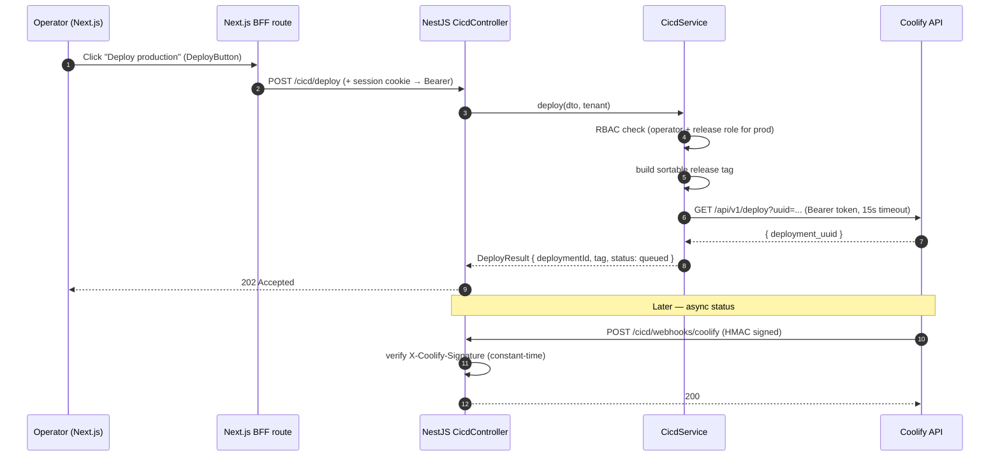

# Phase 2 — CI/CD "One-Button Deploy" Module

Infrastructure management built into the UI. A single click git-tags and promotes an environment via a signed webhook to **Coolify**.

---

## Flow



---

## Security-by-design

| Control | Where |
|---|---|
| **No deploy secret in the browser** | Coolify token lives only in `CicdService`; frontend calls the BFF. |
| **RBAC gating** | `platform:operator` to deploy; `platform:release` additionally required for production. |
| **Signed status webhooks** | `verifyHmacSignature` (constant-time) over the raw body before processing. |
| **Idempotency** | `X-Idempotency-Key` per deploy request. |
| **Timeouts** | 15s `AbortSignal.timeout` on the upstream call; failures map to `502`. |
| **Audit logging** | Every deploy logs actor, project, environment, tag. |

---

## Files

| File | Role |
|---|---|
| `apps/web/src/components/deploy-button.tsx` | Frontend trigger (state machine: idle→deploying→success/error). |
| `apps/web/src/app/api/bff/cicd/deploy/route.ts` | BFF proxy (attaches session, hides API). |
| `apps/api/src/cicd/cicd.controller.ts` | `POST /cicd/deploy` + `POST /cicd/webhooks/coolify`. |
| `apps/api/src/cicd/cicd.service.ts` | RBAC, tag build, Coolify call. |
| `apps/api/src/cicd/dto/deploy.dto.ts` | Validated request contract. |
| `apps/api/src/common/security/signature.util.ts` | Shared HMAC verification. |

---

## Config

```
COOLIFY_API_URL=https://coolify.internal
COOLIFY_API_TOKEN=...
COOLIFY_WEBHOOK_SECRET=...
COOLIFY_APP_PRAXARCH_WEB_PRODUCTION=<app-uuid>
COOLIFY_APP_PRAXARCH_WEB_STAGING=<app-uuid>
```

The Cmd+K command menu also exposes "Deploy → staging/production" as first-class actions.
