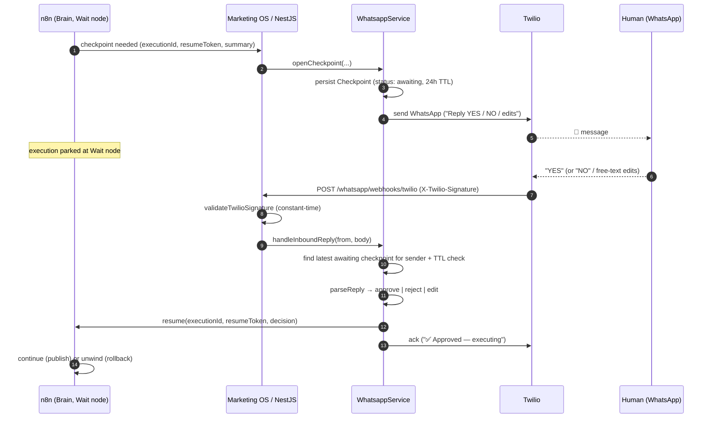

# Phase 3 — WhatsApp HITL Checkpoint Engine

High-stakes agent decisions (draft content, budget changes, alerts) pause and wait for a human. Instead of email, the agent sends a **WhatsApp** message; the human's reply resumes or rolls back the workflow.

---

## The Async Pause-and-Resume Flow

---

## Why this design

| Concern | Decision |
|---|---|
| **Correlation** | Inbound SMS only carries the sender number → look up that approver's latest `awaiting` checkpoint. |
| **Resumability** | n8n parks at a **Wait node**; we hold `executionId` + `resumeToken` to drive it. |
| **Decision parsing** | `parseReply` maps yes/no synonyms (incl. 👍/✅); anything else = edit instructions, re-incorporated by the agent. |
| **Expiry** | 24h TTL; expired checkpoints can't be actioned (prevents stale approvals). |
| **Autonomy coupling** | Checkpoints are only opened when tenant autonomy = `APPROVAL_REQUIRED`. `FULLY_AUTONOMOUS` skips them. |

---

## Security-by-design

| Control | Where |
|---|---|
| **Twilio signature validation** | `validateTwilioSignature` — HMAC-SHA1 over URL + sorted params, base64, constant-time. No payload processed before it passes. |
| **n8n resume protection** | `X-Resume-Token` (per-checkpoint) so a leaked resume URL alone can't drive a workflow. |
| **No tenant session on webhook** | Webhook route excluded from `TenantResolverMiddleware`; tenant resolved from the verified checkpoint instead. |
| **Empty TwiML response** | We send our own acks via REST; Twilio doesn't auto-reply. |

---

## Files

| File | Role |
|---|---|
| `whatsapp.controller.ts` | `POST /whatsapp/webhooks/twilio` — verify + dispatch. |
| `whatsapp.service.ts` | `openCheckpoint` + `handleInboundReply` orchestration. |
| `n8n-client.service.ts` | Resumes/aborts the parked workflow. |
| `twilio-signature.util.ts` | Twilio's exact signature scheme. |
| `reply-parser.ts` | Free-text reply → structured decision. |
| `checkpoint.repository.ts` | Persistence boundary (in-memory ↔ Postgres tenant schema). |
| `checkpoint.types.ts` | `Checkpoint` + `CheckpointDecision`. |

Also supports **on-demand inbound triggers**: an unmatched inbound message (no awaiting checkpoint) is the hook point for SMS-initiated commands.
