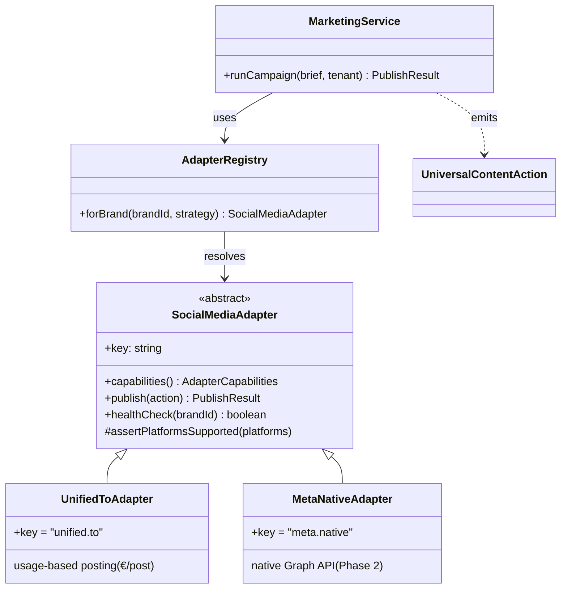
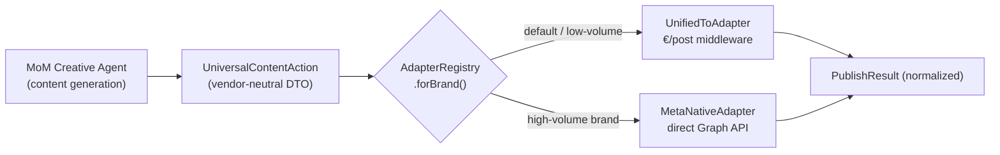

# Phase 4 — Marketing OS & Customer Acquisition Adapter

The Marketing OS generates content (the Brain) and distributes it (the Plumbing). The two are separated by the **Adapter Pattern** so distribution backends swap without touching content generation or business logic.

---

## The Seam

---

## Phase 1 → Phase 2 swap

**Invariant:** `BRAIN` and `ACTION` never change when you switch the resolved adapter. The Brain emits intent; the Plumbing executes it. Adding TikTok/Google = add an adapter to the module, nothing upstream changes.

---

## The Flow (`MarketingService.runCampaign`)

1. **Brain** — `generateContent()` (delegates to n8n/MoM Creative agent; under `APPROVAL_REQUIRED` autonomy this opens a WhatsApp checkpoint first).
2. **Contract** — wrap output in a `UniversalContentAction` (idempotent `actionId`).
3. **Plumbing** — `registry.forBrand()` resolves the adapter; `adapter.publish()` fans out per platform.
4. **Credits** — reserve an estimate before publish, settle on `result.totalCostEur` after.

---

## `UnifiedToAdapter` details (usage-based)

| Aspect | Behavior |
|---|---|
| Pricing | `usage` model, `PER_POST_EUR` per platform → surfaced to the Credit Engine. |
| Platform mapping | Neutral names (`instagram`) → Unified.to types (`INSTAGRAM`). |
| Idempotency | `X-Idempotency-Key = actionId:platform` dedupes retries. |
| Fault isolation | `Promise.all` with per-platform `.catch` → one platform's failure can't sink the batch. |
| Retryability | `429`/`5xx` → `AdapterError(retryable: true)`; `4xx` → non-retryable. |
| Timeouts | 20s `AbortSignal.timeout` per post. |

---

## Files

| File | Role |
|---|---|
| `marketing/contracts.ts` | Universal Action contracts (`UniversalContentAction`, `PublishResult`, capabilities). |
| `marketing/adapters/social-media.adapter.ts` | **Abstract** `SocialMediaAdapter` — the seam. |
| `marketing/adapters/unified-to.adapter.ts` | Concrete Phase-1 plumbing (usage-based). |
| `marketing/adapters/meta-native.adapter.ts` | Phase-2 swap-target skeleton (same contract). |
| `marketing/adapter.registry.ts` | Per-brand adapter resolution. |
| `marketing/marketing.service.ts` | Orchestrates Brain → Contract → Plumbing + credit hooks. |

---

## Why this satisfies "Modular Brain, Universal Plumbing"

- **Modular Brain:** content generation depends only on `UniversalContentAction` + `SocialMediaAdapter`. It is testable with a fake adapter and has zero vendor imports.
- **Universal Plumbing:** every vendor speaks the same contract; volatility (API changes, bans, pricing) is quarantined inside one adapter file.
