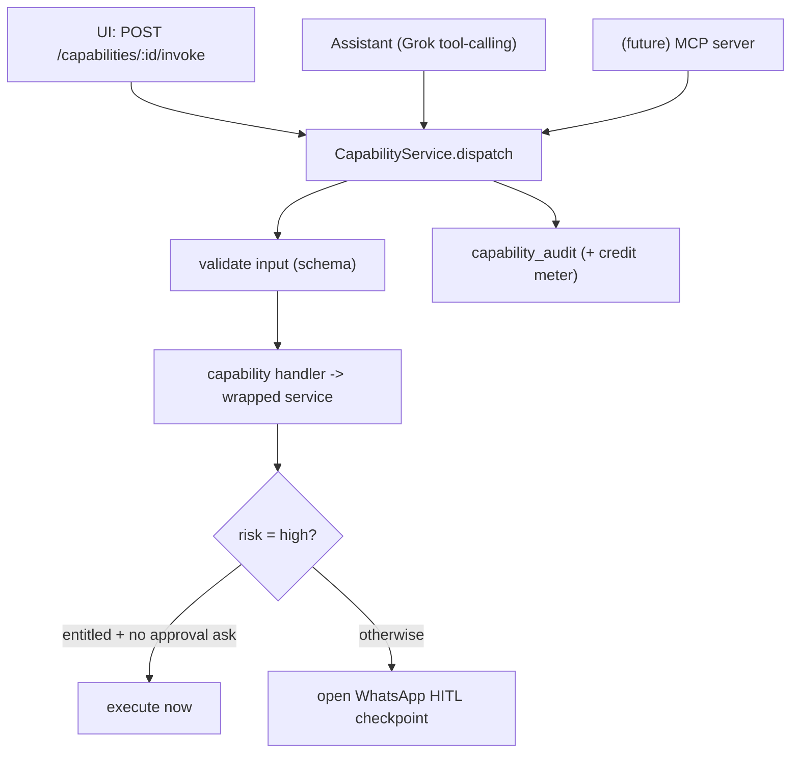

# Assistant & Capability Layer

How Praxarch turns every interface action into a typed, guarded **capability** and
lets a general agentic **assistant** run those same capabilities on the user's
behalf. This is the shared foundation the Deployments, WhatsApp, and (later)
Customer Acquisition + CRM features all dispatch through.

> Status: implemented in the API (`apps/api/src/capabilities`, `apps/api/src/assistant`)
> and wired into the Next.js shells. API v0.6.0 / Web v0.10.0.

---

## 1. Why a capability layer

The UI, the in-app assistant, and a future external MCP server must all be able to
perform the same actions with the same guarantees. Rather than re-implement RBAC,
approvals, auditing, and credit metering per surface, every action is a single
**capability** dispatched through one service.

## 2. Anatomy of a capability

Defined in [capability.types.ts](apps/api/src/capabilities/capability.types.ts); the
catalogue lives in [capability.definitions.ts](apps/api/src/capabilities/capability.definitions.ts).

- `id` (e.g. `deployments.promoteProduction`), `title`, `domain`.
- `kind`: `query` (reads) vs `command` (writes).
- `risk`: `low | medium | high`. High-risk drives the HITL gate.
- `inputSchema`: a minimal JSON-schema used **both** to validate input and to
  describe the tool to the LLM.
- `credits`: rough action-credit cost, written to the audit/usage ledger.
- `handler`: a closure that calls the existing service (no logic duplication).

### Registered capabilities (initial)

| id | kind | risk | wraps |
|---|---|---|---|
| `deployments.listServices` | query | low | `ServicesService.list` |
| `deployments.createService` | command | medium | `ServicesService.create` |
| `deployments.provisionService` | command | high | `CoolifyProvisioningService.provision` (owner role; creates Coolify app + `deploy_targets` row) |
| `deployments.updateServiceConfig` | command | medium | `ServicesService.updateConfig` |
| `deployments.deployStaging` | command | medium | `CicdService.deploy` (staging) |
| `deployments.promoteProduction` | command | high | `CicdService.deploy` (prod) **or** WhatsApp HITL |
| `content.publish` | command | high | `MarketingService.publishApprovedContent` **or** WhatsApp HITL |

## 3. Dispatch semantics

[capability.service.ts](apps/api/src/capabilities/capability.service.ts):

1. Look up the capability; `404` if unknown.
2. Validate input against its schema.
3. Run the handler. RBAC for low/medium actions is enforced by the wrapped
   service (which throws). High-risk handlers decide **auto-run vs approval**:
   - `deployments.promoteProduction` runs directly only if the caller holds
     `platform:release` and didn't ask for approval; otherwise it opens a deploy
     HITL checkpoint and returns `awaiting_approval`.
   - `content.publish` runs directly only for an `owner`; otherwise HITL.
4. Write a `capability_audit` row (tenant, capability, source, actor, status,
   credits, input, result) — best-effort, never fails the action.

`requestApproval: true` on the invoke forces the HITL path even when entitled —
used to demo the WhatsApp loop and as a caution switch.

## 4. The assistant

[assistant.service.ts](apps/api/src/assistant/assistant.service.ts) exposes the
capability catalogue to **xAI Grok** as tools and runs a tool-calling loop; each
tool call dispatches through `CapabilityService`, so the assistant inherits every
guarantee above. `POST /assistant/chat` streams Server-Sent Events
(`tool_start` / `tool_result` / `text` / `done` / `error`).

- Config: `GROK_API_KEY` (or `XAI_API_KEY`), `GROK_API_URL` (default
  `https://api.x.ai/v1`), `GROK_MODEL` (default `grok-2-latest`).
- **No key?** A deterministic placeholder router still handles "list services",
  "deploy X to staging", and "promote X to prod" so the wiring is demoable
  (per the unprovisioned-key convention).
- The system prompt is inlined for now; production composes it from the Dynamic
  Prompt Registry (the `/admin/prompts` surface).

### Frontend surface

A global slide-over **Assistant panel** + provider mount in both the tenant and
admin shells ([assistant-panel.tsx](apps/web/src/components/assistant/assistant-panel.tsx),
[assistant-context.tsx](apps/web/src/components/assistant/assistant-context.tsx)):

- Toggle from the top-bar button or `Cmd/Ctrl+J`.
- `Cmd+K` hands typed input off to the assistant ("Ask: …").
- The panel streams text and shows a chip per tool run with its status
  (`ok` / `sent for approval` / `error`).
- It carries the current `{ tenant, module, route }` as context.
- `StrategyChat` (Acquisition) now hands off to the same assistant.

BFF proxies: [/api/bff/assistant/chat](apps/web/src/app/api/bff/assistant/chat/route.ts)
(streaming), [/api/bff/capabilities](apps/web/src/app/api/bff/capabilities/route.ts),
[/api/bff/capabilities/:id/invoke](apps/web/src/app/api/bff/capabilities/[id]/invoke/route.ts).

## 5. Deployments + WhatsApp completeness

- **Simulation driver.** `DEPLOY_DRIVER=simulate` (the default when Coolify is
  unconfigured) makes `CicdService` fake the deploy and log
  `queued -> building -> success`, so the full loop runs with no external account.
  Set `DEPLOY_DRIVER=coolify` (+ `COOLIFY_*`) for the real path.
- **Dev approve.** `POST /whatsapp/dev/approve` (hard-gated to `AUTH_PROVIDER=none`)
  stands in for an inbound Twilio reply so promote/publish -> approve -> execute
  is demoable locally. The real Twilio inbound signature path is unchanged.
- **Approver from settings.** The HITL approver now resolves from
  `public.workspace_settings.approver_wa_id` (env `DEPLOY_APPROVER_WAID` fallback)
  via [WorkspaceSettingsService](apps/api/src/settings/workspace-settings.service.ts).

## 6. Local demo (no external accounts)

1. `docker compose up` (with `AUTH_PROVIDER=none`).
2. In the Assistant panel: "promote web to prod" -> returns *sent for approval*
   (member path) or runs directly (owner). To force approval, ask "...request approval".
3. `POST /api/bff/whatsapp/dev/approve { "reply": "YES" }` -> the simulated deploy
   runs; API logs show `queued -> building -> success`.
4. `GET /capabilities` lists the catalogue the assistant and UI share.

## 7. Still to do

- ~~Stream live deploy status to the Deployments UI~~ — done in Gate 1.1 (`deploy_runs` + SSE `/cicd/deployments/:id/stream`). See [10-coolify-setup-guide.md](10-coolify-setup-guide.md) for real Coolify wiring.
- Per-kind approvers + autonomy-driven auto-run thresholds from settings.
- Schema-per-tenant + RLS for `capability_audit` / `workspace_settings`.
- External MCP server reflecting the same registry (deferred).
