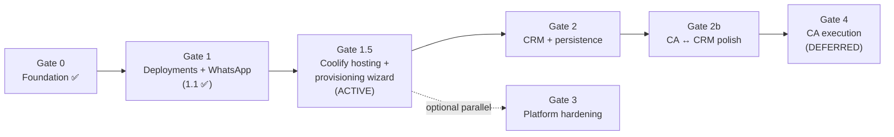

# Praxarch Master Plan — Phases, Gates & Build Order

**Single source of truth for what to build next.**  
When in doubt, follow this document top-to-bottom. Do not re-litigate build order unless a gate fails or requirements change.

> **Current versions:** API v0.7.0 · Web v0.15.0  
> **Last updated:** 2026-06-06

---

## Locked decisions (do not revisit without explicit user approval)

| Decision | Choice |
|---|---|
| **First production concern** | Deployments + WhatsApp HITL working end-to-end (simulate now, real creds when available) |
| **Customer Acquisition execution** | **Deferred** — plan locked in `.cursor/plans/customer_acquisition_master_plan_f5ee490f.plan.md` |
| **CRM scope** | Lightweight Contacts + Pipeline only; Starter tier; n8n for workflows |
| **Shared action layer** | All UI, assistant, and (later) MCP dispatch through **capabilities** |
| **Coolify provisioning wizard** | **NOW — Gate 1.5 (active).** Full self-service: add a repo → Praxarch provisions the Coolify app → deploy/promote via UI, assistant, and WhatsApp HITL. Tenants never touch Coolify directly. |
| **Coolify hosting** | **Self-hosted by us.** Coolify added to the Docker stack for local/dev; one shared Coolify instance per environment in staging/prod. Tenants share the engine; isolation via Coolify project/app + `tenant_id` + RBAC. |
| **Multi-tenancy target** | Schema-per-tenant + RLS (prototype uses `public` + `tenant_id` TEXT slug) |

---

## How gates work

Each **gate** has:

1. **Entry criteria** — prerequisites that must be true before starting work in that gate.
2. **Deliverables** — concrete outputs (code, tables, BFF routes, docs).
3. **Exit criteria (PASS)** — a short demo script or checklist. **Do not start the next gate until PASS.**

Gates are **sequential**. Parallel work inside a gate is fine; skipping gates is not.



---

## Gate 0 — Shared foundation ✅ PASS

**Purpose:** Capability layer, assistant, dev simulation path, and durable HITL/deploy persistence so every later module reuses one dispatch path.

### Deliverables (done)

| Item | Location / notes |
|---|---|
| Capability registry + dispatch | `apps/api/src/capabilities/` |
| Assistant (Grok tools + SSE) | `apps/api/src/assistant/` |
| Assistant UI (panel, Cmd+J, Cmd+K) | `apps/web/src/components/assistant/` |
| `DEPLOY_DRIVER=simulate` | `CicdService` — queued → building → success |
| Dev approve endpoint | `POST /whatsapp/dev/approve` (AUTH_PROVIDER=none) |
| Workspace settings table | `workspace_settings` + `WorkspaceSettingsService` |
| Capability audit | `capability_audit` table |
| Docs | [08-assistant-and-capabilities.md](08-assistant-and-capabilities.md) |

### Exit demo (PASS — run anytime to confirm)

1. `docker compose up` with `AUTH_PROVIDER=none`.
2. Assistant: *"promote web to prod"* → `awaiting_approval` (or direct if owner).
3. `POST /api/bff/whatsapp/dev/approve { "reply": "YES" }` → simulated deploy completes.
4. `GET /capabilities` returns the catalogue.

**Status: PASS.** Gate 1 is the active workstream.

---

## Gate 1 — Deployments + WhatsApp “working” (ACTIVE — your #1 priority)

**Purpose:** Finish the deploy + HITL loop so it is trustworthy in Docker (simulate) and switchable to real Coolify/Twilio without rework. This is the logical next step — **not** CRM backend yet.

**Entry criteria:** Gate 0 PASS.

### 1.1 Live deploy status in the UI

| Deliverable | Detail |
|---|---|
| Coolify webhook → event bus | `POST /cicd/webhooks/coolify` updates deploy state (already wired; ensure handler emits internal event) |
| Status stream to web | SSE or polling endpoint `GET /cicd/deployments/:id/status` (or WebSocket later) |
| Deployments UI | Service cards show live status (queued / building / success / failed), not only logs |
| Simulate path parity | `DEPLOY_DRIVER=simulate` emits the same events so UI works without Coolify |

**Exit check:** Promote → approve → watch status transition in the Deployments module without reading API logs.

> **1.1b (local Coolify in Docker)** is no longer a small optional step — it has been
> promoted into the full **Gate 1.5** below, which makes self-hosted Coolify + the
> provisioning wizard the next active workstream.

### 1.2 Approver + autonomy settings UI

| Deliverable | Detail |
|---|---|
| Account / workspace settings page | Edit `approver_wa_id`, per-domain autonomy (deploy vs content) |
| BFF + API | `GET/PATCH /settings/workspace` (tenant-scoped) |
| Capability auto-run | High-risk capabilities respect autonomy: entitled owner may auto-run; member always HITL unless configured |
| Overview pending actions | Rows for awaiting HITL link to deploy/content context |

**Exit check:** Change approver in UI → promote → dev-approve with new approver WA ID (or env fallback documented).

### 1.3 Real Twilio path (cred-ready, not blocking simulate)

| Deliverable | Detail |
|---|---|
| Inbound webhook | Signature verification already in `whatsapp.controller.ts` — document tunnel setup (ngrok/cloudflared) |
| Outbound send | `sendWhatsapp` logs when unset; document `TWILIO_*` env vars |
| E2E doc section | Add “Real creds path” to [03-whatsapp-hitl.md](03-whatsapp-hitl.md) and [08-assistant-and-capabilities.md](08-assistant-and-capabilities.md) §6 |

**Exit check:** With Twilio creds + tunnel, inbound YES resumes checkpoint and executes deploy (Coolify or simulate per driver).

### 1.4 Deployments UI ↔ capabilities (optional within Gate 1)

| Deliverable | Detail |
|---|---|
| Promote / staging buttons | Call `POST /capabilities/:id/invoke` via BFF (same path as assistant) |
| Cmd+K | Surface deploy commands that use capabilities |

**Exit check:** Click “Deploy staging” in UI and assistant command produce identical audit rows.

### Gate 1 PASS checklist

- [x] Deploy status visible in UI for simulate **and** coolify drivers (1.1 — polling + SSE; Coolify guide in [10](10-coolify-setup-guide.md))  
- [ ] Approver editable in workspace settings (not env-only)  
- [ ] Full loop: promote → HITL → approve → deploy → UI shows success  
- [ ] Real Twilio path documented and tested once creds exist  
- [ ] `docs/08` §7 “Still to do” items for this gate struck or moved to Gate 3  

> **Sequencing change (2026-06-06):** Per decision, **Gate 1.5 (Coolify hosting +
> provisioning wizard) is now the immediate next workstream.** 1.2/1.3/1.4 remain
> open and can run alongside 1.5, but the priority is a real, self-service deploy.
> Gate 2 (CRM) does not start until Gate 1.5 PASS.

---

## Gate 1.5 — Self-hosted Coolify + provisioning wizard (ACTIVE — next)

**Purpose:** Make deployments **fully self-service** and **real** end-to-end. A tenant
adds a Git repo in the Deployments UI (or asks the assistant); Praxarch **provisions a
Coolify application** for them, stores the mapping, and lets them deploy/promote through
the existing capabilities + WhatsApp HITL rail — **without ever opening Coolify, creating
tokens, or editing env vars.** Coolify is hosted by us (Docker locally; shared instance in
staging/prod).

**Entry criteria:** Gate 1.1 PASS (live status streaming) — done.

> **Detailed implementation plan:** [11-coolify-provisioning-plan.md](11-coolify-provisioning-plan.md)
> — verified Coolify API contracts, data model, step-by-step build order. First target is a
> **private GitHub repo** (deploy-key path), so the secrets vault (1.5e) is brought forward.

**North star (the UX we are buying):**

```text
Tenant: "Deploy my storefront"  →  Add repo + branch  →  [Provision]
Praxarch → Coolify API: create project + application + envs + webhook
Praxarch DB: store { tenant, service, coolifyProjectUuid, coolifyAppUuid }
Tenant: Deploy staging / Promote prod (WhatsApp approve) → live status
Tenant NEVER sees: Coolify UI, API tokens, app UUIDs, server config.
```

### 1.5a — Host Coolify in the Docker stack

| Deliverable | Detail |
|---|---|
| Compose service | Add `coolify` to `docker-compose.yml` behind a **`coolify` profile** (heavy stack: own DB/Redis/proxy). Host port **3980** → container 8000 |
| Docker socket | Mount `/var/run/docker.sock` so Coolify can build/run apps. **Document Windows/WSL2 caveat** (Docker Desktop socket); recommend WSL2 backend |
| Network | Same `praxarch_net`; API reaches `http://coolify:8000` internally |
| Bootstrap | One-time: create root user + API token in local Coolify UI; capture token into root `.env` (`COOLIFY_API_URL`, `COOLIFY_API_TOKEN`) |
| Docs | [05-docker-and-ports.md](05-docker-and-ports.md) port map (done) + [10-coolify-setup-guide.md](10-coolify-setup-guide.md) Tier B section |

**Exit check:** `docker compose --profile coolify up` → Coolify reachable at `localhost:3980`; API can authenticate against `coolify:8000` (`GET /api/v1/version`).

### 1.5b — Per-tenant deploy config in Postgres (retire env-var mapping)

Today the project→app UUID mapping lives in `COOLIFY_APP_*` env vars. Move it to the DB so
provisioning can write it and tenants can have many services.

| Table | Fields |
|---|---|
| `deploy_targets` | `id`, `tenant_id`, `service_id`, `environment`, `coolify_project_uuid`, `coolify_app_uuid`, `repo`, `branch`, `git_provider`, `created_at` |
| (reuse) `deploy_services` | already holds per-tenant services + environments |

| Deliverable | Detail |
|---|---|
| `DeployTargetsService` | CRUD; `resolveCoolifyAppUuid()` reads DB first, env var only as fallback |
| `CicdService` | `resolveCoolifyAppUuid` already checks `env.coolifyAppUuid`; extend to read `deploy_targets` |
| Migration | `infra/postgres/init/004-deploy-targets.sql` |

### 1.5c — Provisioning backend (Praxarch → Coolify API)

Coolify exposes the needed endpoints (verified): **Projects Create**, **Create Environment**,
**Applications Create (Public / Private-Deploy-Key / Private-GH-App)**, **Create Env**, and
**Notifications/webhook** config.

| Deliverable | Detail |
|---|---|
| `CoolifyProvisioningService` | `provisionApp({ tenant, service, repo, branch, env, isPrivate })` → create project (once per tenant) → create application → set envs → register Praxarch webhook → return `{ projectUuid, appUuid }` |
| Private repos | Support GitHub App or deploy key path; public repo path first for the demo |
| Idempotency | Re-provision is safe (look up existing project/app by name before create) |
| Capability | `deployments.provisionService` (command, **high** risk → owner or WhatsApp HITL) wrapping the above |
| Audit | `capability_audit` row per provision |

### 1.5d — Provisioning wizard (frontend)

The `AddDeploymentWizard` already collects type/repo/branch/token/coolifyApp. Wire it to real provisioning.

| Deliverable | Detail |
|---|---|
| Wizard → BFF | `POST /api/bff/cicd/services` now triggers **provision** (not just a DB row): create service + call `deployments.provisionService` |
| Progress UI | Show provisioning steps (creating project → app → webhook) with the same status-chip pattern as deploys |
| Remove secret-leak risk | GitHub token (private repos) posts to BFF → API → vault; never stored client-side |
| Empty-state | "Add your first deployment" CTA on Deployments when a tenant has no services |

### 1.5e — Secrets vault for provisioning creds

| Deliverable | Detail |
|---|---|
| Vault abstraction | `SecretsService` interface; local impl = encrypted Postgres column or env-key; prod = AWS Secrets Manager (documented) |
| Stored secrets | Per-tenant GitHub token / deploy key; Coolify token stays platform-level (operator), **not** per tenant |
| Never in browser | All writes via BFF → API |

### 1.5f — Assistant + Cmd+K parity

| Deliverable | Detail |
|---|---|
| Assistant tools | "deploy my X", "provision a new app from repo Y" route through `deployments.provisionService` + `deployments.deployStaging` |
| Cmd+K | "Add deployment", "Deploy staging", "Promote production" as capability-backed commands |

### Gate 1.5 PASS checklist

- [ ] `docker compose --profile coolify up` brings up a working Coolify the API can call  
- [ ] Add a **public** GitHub repo in the wizard → Praxarch provisions a Coolify app (no manual Coolify steps)  
- [ ] Provisioned app's `coolify_app_uuid` persisted in `deploy_targets`  
- [ ] Deploy staging on the provisioned service → real Coolify build → UI streams `queued → building → success`  
- [ ] Promote production → WhatsApp HITL → approve → real prod deploy  
- [ ] Same flow works when triggered from the **assistant**  
- [ ] No Coolify token / app UUID / env var touched by the tenant in the happy path  
- [ ] Docs updated: [02-cicd-deployment.md](02-cicd-deployment.md) (provisioning contract), [10-coolify-setup-guide.md](10-coolify-setup-guide.md) (operator setup), [08](08-assistant-and-capabilities.md) (`provisionService` capability)  

**Do not start Gate 2 until Gate 1.5 PASS** (1.2/1.3/1.4 may complete in parallel).

---

## Gate 2 — CRM backend + persistence + n8n events

**Purpose:** Replace CRM mock data with Postgres + NestJS; Kanban drag persists; stage changes emit n8n webhooks. Acquisition Leads can then point at real contact IDs.

**Entry criteria:** Gate 1.5 PASS (self-service real deploys working — avoids splitting attention while your top concern is unfinished).

### 2.1 Data model + API

| Table | Fields (minimal) |
|---|---|
| `crm_contacts` | `id`, `tenant_id`, `name`, `email`, `phone`, `source`, `attribution` (JSONB), `custom_fields` (JSONB), timestamps |
| `crm_opportunities` | `id`, `tenant_id`, `contact_id`, `title`, `stage`, `value`, `expected_close`, timestamps |
| `crm_stages` | `tenant_id`, `key`, `label`, `sort_order` (seed defaults per tenant) |

| Module | Endpoints |
|---|---|
| `apps/api/src/crm/` | `GET/POST/PATCH /crm/contacts`, `GET/POST/PATCH /crm/opportunities`, `PATCH /crm/opportunities/:id/stage`, `GET /crm/stages` |
| BFF | Mirror under `/api/bff/crm/*` with tenant header |

### 2.2 Capabilities

Register (same patterns as deployments):

| id | kind | risk |
|---|---|---|
| `crm.contacts.list` | query | low |
| `crm.contacts.create` | command | medium |
| `crm.contacts.update` | command | medium |
| `crm.opportunities.changeStage` | command | medium |

### 2.3 Frontend wiring

| Deliverable | Detail |
|---|---|
| `CrmHub` | Fetch from BFF; optimistic Kanban drag → `PATCH .../stage` |
| `mock-data.ts` | Keep as fallback when API down (same pattern as deployments) |
| Assistant | Tools for “move deal X to qualified” via capabilities |

### 2.4 n8n outbound events

On stage change (and on `won`):

| Event | Payload |
|---|---|
| `crm.opportunity.stage_changed` | `{ tenantId, opportunityId, fromStage, toStage, contactId }` |
| `crm.opportunity.won` | above + `value`; future hook for CA conversion upload |

Emit via internal event bus → `POST` to tenant-configured n8n webhook URL (store in `workspace_settings` or `automations` config later).

### Gate 2 PASS checklist

- [ ] Create contact + opportunity via API; visible in CRM UI after refresh  
- [ ] Drag Kanban card → persists after reload  
- [ ] `capability_audit` row for stage change  
- [ ] n8n webhook receives `crm.opportunity.stage_changed` (n8n workflow stub in repo)  
- [ ] Docs: update [06-modules-and-entitlements.md](06-modules-and-entitlements.md) §CRM — remove “deferred API”  

---

## Gate 2b — Acquisition ↔ CRM polish (small, after Gate 2)

**Purpose:** Deep-link and cross-surface navigation without building CA execution.

**Entry criteria:** Gate 2 PASS (real `contact_id` values exist).

| Deliverable | Detail |
|---|---|
| CRM deep-link | `/app/[tenant]/crm?contact=ct_acme_1` opens drawer for that contact |
| CRM deep-link | `?tab=contacts` / `?tab=pipeline` |
| Acquisition Leads tab | Each lead card links to `crm?contact={crmContactId}` |
| CRM bridge card | “View in Acquisition” when `source` is ad-derived (already partial) |

**Exit check:** From Acquisition Leads → click lead → CRM drawer opens on correct contact; browser back works.

**Note:** This is intentionally **after** Gate 2 so IDs are stable. Doing deep-links against mock IDs first is wasted churn.

---

## Gate 3 — Platform hardening (parallel-friendly after Gate 1)

**Purpose:** Production hygiene. Can run alongside Gate 2 if someone else owns it, but **must not block** Gate 1 exit.

| Item | Detail |
|---|---|
| Schema-per-tenant + RLS | Migrate `hitl_checkpoints`, `deploy_services`, `content_drafts`, `workspace_settings`, `capability_audit`, then CRM tables |
| Entitlements server-side | Mirror `modules.ts` checks in NestJS (UI checks are not security boundary) |
| Credit metering enforcement | Hard stop or grace at 0 credits |
| External MCP server | Same capability registry (explicitly deferred until Gates 1–2 stable) |

---

## Gate 4 — Customer Acquisition execution (DEFERRED)

**Do not start until:** Gates 1–2 PASS and user explicitly lifts deferral.

**Plan reference:** `.cursor/plans/customer_acquisition_master_plan_f5ee490f.plan.md`

Locked order inside CA (when started):

1. Meta CAPI + Google offline conversions  
2. Dual stitching (`client_reference_id` + Stripe metadata)  
3. GeoLift before GrowthBook  
4. Won-deal → conversion upload (CRM `crm.opportunity.won` event from Gate 2)

---

## Gate 5+ — Later modules (backlog)

| Gate | Module | Notes |
|---|---|---|
| 5 | Automations | n8n “Your Agents” UI wired to real workflow triggers; Browser Use Cloud runs |
| 6 | Finances | Scale tier; country-specific filing guidance |
| 7 | Auth production | Cognito / external JWT; retire `AUTH_PROVIDER=none` demo |

> *(The Coolify provisioning wizard moved out of this backlog into the active **Gate 1.5**.)*

---

## What to do next (one sentence)

**Build Gate 1.5** — host Coolify in Docker, then a provisioning wizard so a tenant adds a repo and Praxarch creates the Coolify app + deploys it via UI/assistant/WhatsApp, with **zero** Coolify exposure to the tenant.

### Suggested implementation order within Gate 1.5

1. **1.5a** Host Coolify in the Docker stack (`--profile coolify`) + API can authenticate  
2. **1.5b** `deploy_targets` table; resolve app UUID from DB (retire env-var mapping)  
3. **1.5c** `CoolifyProvisioningService` + `deployments.provisionService` capability (public repo first)  
4. **1.5d** Wire the Add-Deployment wizard to real provisioning with progress UI  
5. **1.5e** Secrets vault for private-repo creds  
6. **1.5f** Assistant + Cmd+K parity  

*(Gate 1 items 1.2/1.3/1.4 may proceed in parallel; they are not blockers for 1.5.)*

---

## Doc map

| Doc | Role |
|---|---|
| [00-architecture-blueprint.md](00-architecture-blueprint.md) | Component topology |
| [02-cicd-deployment.md](02-cicd-deployment.md) | Coolify deploy contract |
| [03-whatsapp-hitl.md](03-whatsapp-hitl.md) | HITL checkpoint flow |
| [06-modules-and-entitlements.md](06-modules-and-entitlements.md) | Modules, tiers, CA ↔ CRM boundary |
| [08-assistant-and-capabilities.md](08-assistant-and-capabilities.md) | Capability + assistant reference |
| [10-coolify-setup-guide.md](10-coolify-setup-guide.md) | Wire a real app to Coolify + Praxarch |
| [11-coolify-provisioning-plan.md](11-coolify-provisioning-plan.md) | Gate 1.5 detailed implementation plan |
| **09-master-plan.md** (this file) | **Build order and gates** |
| `.cursor/plans/assistant_deployments_whatsapp_*.plan.md` | Gate 0 task breakdown (complete) |
| `.cursor/plans/customer_acquisition_master_plan_*.plan.md` | Gate 4 (deferred) |

---

## Gate status board

| Gate | Status | Blocker |
|---|---|---|
| 0 — Foundation | ✅ PASS | — |
| 1 — Deployments + WhatsApp | 🟡 IN PROGRESS | 1.1 done; 1.2/1.3/1.4 open (parallel) |
| 1.5 — Coolify hosting + provisioning wizard | 🟢 ACTIVE (next) | Host Coolify in Docker; provision apps; self-service deploy |
| 2 — CRM + n8n | ⬜ NOT STARTED | Gate 1.5 PASS |
| 2b — CA ↔ CRM polish | ⬜ NOT STARTED | Gate 2 PASS |
| 3 — Platform hardening | ⬜ NOT STARTED | Optional parallel after Gate 1.5 |
| 4 — CA execution | 🔒 DEFERRED | User + Gates 1–2 |
