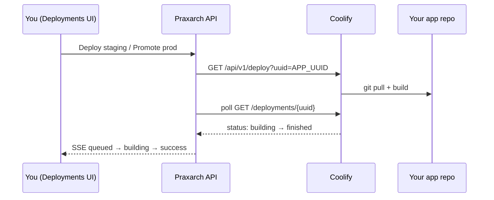

# Coolify Setup Guide — Real Production Deploys from Praxarch

Use this guide to connect **your own app** (not yet on Coolify) to Praxarch Deployments so **Promote → production** triggers a real Coolify build and the UI streams live status.

> **Prerequisite:** Gate 1.1 code (deploy runs + SSE). API v0.7.0+ / Web v0.15.0+.

---

## Where Coolify lives (read this first)

Praxarch is **Docker-first**. Coolify is the intended **self-hosted** deploy target (see README + architecture blueprint). There are three tiers — not three different products:

| Tier | What runs | When | Status |
|---|---|---|---|
| **A — Simulate** | No Coolify. `DEPLOY_DRIVER=simulate` fakes builds inside the API. | Default `docker compose up` today | ✅ Works now |
| **B — Local Coolify** | Coolify runs on your dev machine (Docker). Praxarch API calls it over the network. | **Intended path for real local deploy proof** | 🟡 Planned — not in `docker-compose.yml` yet |
| **C — Production Coolify** | Coolify on a VPS / Coolify Cloud. Same API integration, different URL. | Customer-facing deploys later | Documented below |

**Your expectation (Tier B) is correct** for the long-term docker-first plan. What shipped in Gate 1.1 was Tier A plus the **API wiring** for Tier B/C (`COOLIFY_API_URL`, polling, webhooks). The guide below currently emphasises Tier C (external install) because that is the fastest way to prove a *separate* app today — but **adding Coolify to the Praxarch Docker stack is the next infra step** (Gate 1.1b in [09-master-plan.md](09-master-plan.md)).

```text
Today:     docker compose → web + api + postgres + redis + n8n  (no Coolify service)
Target:    docker compose → … + coolify (profile)  →  API uses COOLIFY_API_URL=http://coolify:8000
```

**Why Coolify is not in compose yet:** Coolify is a full PaaS (its own DB, Redis, proxy) and needs access to the **host Docker socket** to build and run your apps. That is heavier than n8n/Postgres and was deferred so Gate 1.1 could ship UI status streaming with `simulate` first.

---

## Overview



Praxarch never stores your Coolify token in the browser. The NestJS API holds `COOLIFY_API_TOKEN` and maps each tenant service to a Coolify **application UUID**.

---

## Step 1 — Install Coolify

Pick one:

| Option | When to use |
|---|---|
| **[Coolify Cloud](https://coolify.io/cloud)** | Fastest proof — managed instance, ~$5/mo |
| **Self-hosted VPS** | Hetzner/DigitalOcean Ubuntu 22.04+ with a public IP |

**Self-hosted one-liner** (on a fresh Linux server):

```bash
curl -fsSL https://cdn.coollabs.io/coolify/install.sh | bash
```

Open `http://YOUR_SERVER_IP:8000`, create the root account, and add your server (localhost is fine for single-server setups).

---

## Step 2 — Create a Coolify application for your app

Your app does **not** need to already run on Coolify — you are creating it now.

1. In Coolify: **Projects** → create a project (e.g. `My SaaS`).
2. Add an **Environment** (e.g. `production`). Optionally add `staging` as a second environment.
3. **+ Add Resource** → **Application** → connect your Git provider:
   - **Public repo:** paste the GitHub URL.
   - **Private repo:** install the Coolify GitHub App or add a deploy key.
4. Choose a **build pack:**
   - **Next.js / Node** → Nixpacks (default) or Dockerfile if you have one.
   - Set the **start command** / port Coolify should proxy (e.g. `3000`).
5. Set **Environment variables** your app needs (DB URL, API keys, etc.).
6. Assign a **domain** (Coolify can issue Let's Encrypt SSL) or use the `*.sslip.io` preview domain for testing.
7. Click **Deploy** once manually in Coolify to confirm the app builds and runs.

**Copy the Application UUID** — you need it for Praxarch:

- Coolify UI → your application → **Settings** → UUID in the URL or settings panel, **or**
- API: `GET {COOLIFY_API_URL}/api/v1/applications` with your bearer token.

Example UUID shape: `jkck0w8cc0kw8g8wcs8k8kos`

---

## Step 3 — Create a Coolify API token

1. Coolify → **Keys & Tokens** → **API tokens** → Create.
2. Name it `praxarch-deploy`, scope: deploy/read applications.
3. Copy the token — it is shown once.

---

## Step 4 — Wire Praxarch environment variables

In your Praxarch root `.env` (or host env for Docker):

```env
DEPLOY_DRIVER=coolify
COOLIFY_API_URL=https://coolify.yourdomain.com
COOLIFY_API_TOKEN=your-api-token-here

# Map Praxarch project slug → Coolify app UUID
# Pattern: COOLIFY_APP_{PROJECT_SLUG}_{ENVIRONMENT}
# Project slug = {tenant}-{serviceId} e.g. acme-web for tenant acme, service web
COOLIFY_APP_ACME_WEB_PRODUCTION=jkck0w8cc0kw8g8wcs8k8kos
COOLIFY_APP_ACME_WEB_STAGING=optional-staging-uuid-if-different-app
```

**How the slug is built:** the Deployments UI sends `project: "acme-web"` when tenant is `acme` and service id is `web`. Hyphens become underscores and the env suffix is added → `COOLIFY_APP_ACME_WEB_PRODUCTION`.

Restart the API after changing env:

```bash
docker compose restart api
```

---

## Step 5 — Expose webhooks (optional but recommended)

Coolify can **push** status to Praxarch instead of relying on polling alone.

1. Coolify → **Notifications** → add a **Webhook** destination.
2. URL (production):

   ```
   https://your-praxarch-api.example.com/cicd/webhooks/coolify
   ```

3. For **local dev**, tunnel the API:

   ```bash
   ngrok http 3901
   ```

   Use `https://xxxx.ngrok-free.app/cicd/webhooks/coolify` as the webhook URL.

4. Leave `COOLIFY_WEBHOOK_SECRET` empty for Coolify's native notification payloads. Set a secret only if you add a custom HMAC-signed proxy later.

Coolify sends events like `deployment_success` with `deployment_uuid` — Praxarch matches that to the run it created when you clicked Deploy.

---

## Step 6 — Prove it end-to-end

### A. Simulate first (sanity check)

With `DEPLOY_DRIVER=simulate` (default):

1. Open `http://localhost:3900/app/acme/deployments`
2. Click **Deploy staging** on Web App.
3. Watch the status chip: **Queued → Building… → Deployed** (~2s).
4. The staging row updates version/commit without a page refresh.

### B. Real Coolify deploy

1. Set `DEPLOY_DRIVER=coolify` and all `COOLIFY_*` vars above.
2. Restart API.
3. In Deployments, click **Deploy staging** (or **Promote → production** if you have release role).
4. Watch live status in the UI; confirm build in Coolify's deployment log.
5. On success, the environment row shows `active` and a new tag.

### C. WhatsApp HITL path (production)

1. As Member: **Request prod via WhatsApp**.
2. `POST /api/bff/whatsapp/dev/approve` with `{ "reply": "YES" }` (local guest mode).
3. Approved deploy creates a deploy run and streams the same way.

---

## Troubleshooting

| Symptom | Fix |
|---|---|
| `Deploy not configured` | Missing `COOLIFY_APP_*` env for that project+environment |
| `502` from API | Wrong `COOLIFY_API_URL`, token, or app UUID |
| UI stuck on Queued | API can't reach Coolify; check network/firewall; polling logs in `docker compose logs api` |
| Webhook 401 | `COOLIFY_WEBHOOK_SECRET` set but Coolify sends unsigned notifications — clear the secret |
| Wrong tenant | Pass `x-praxarch-tenant` header (BFF does this for deploy); SSE uses `?tenant=` query |

---

## Staging vs production patterns

| Pattern | Coolify setup | Praxarch env vars |
|---|---|---|
| **One app, one env** | Single application on `main` | Only `COOLIFY_APP_ACME_WEB_PRODUCTION` |
| **Two Coolify apps** | Separate apps for staging/prod branches | Both `..._STAGING` and `..._PRODUCTION` UUIDs |
| **One app, two Coolify environments** | Same project, prod + staging environments | Map each Praxarch env to the matching Coolify app UUID in that environment |

Future (Gate 1.2): store `coolifyAppUuid` per environment in workspace settings instead of env vars.

---

## Related docs

- [02-cicd-deployment.md](02-cicd-deployment.md) — security model
- [09-master-plan.md](09-master-plan.md) — Gate 1 checklist
- [08-assistant-and-capabilities.md](08-assistant-and-capabilities.md) — assistant can trigger the same deploy capabilities
