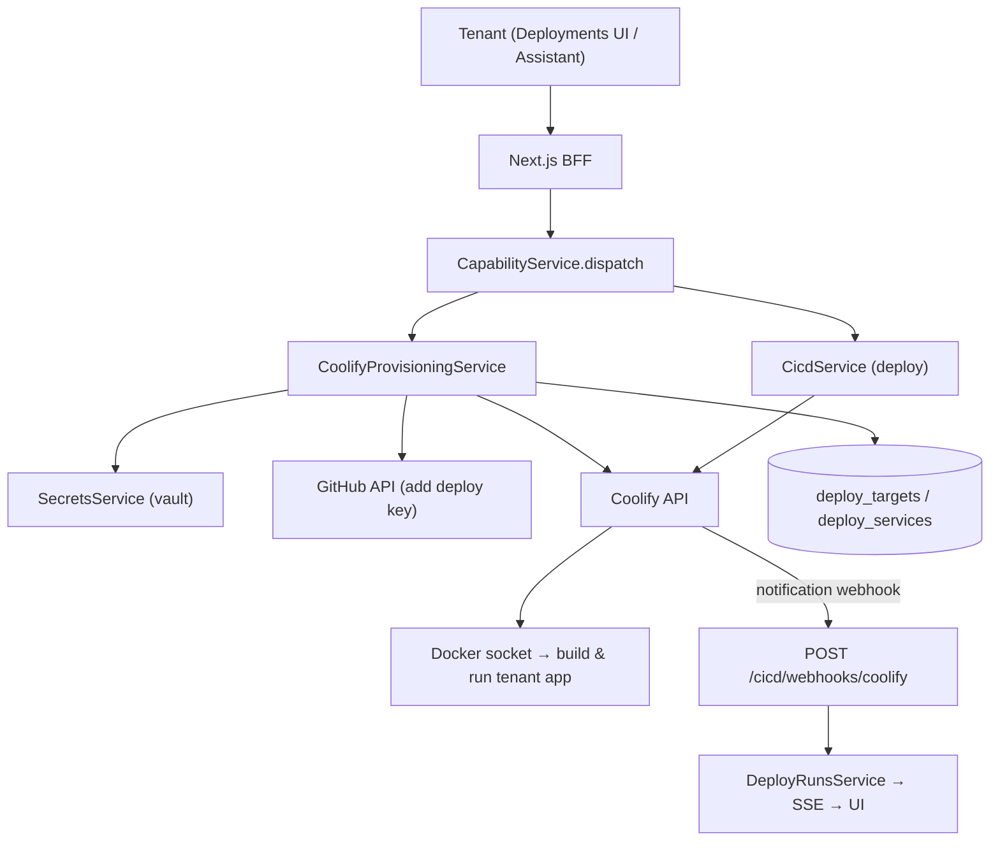

# Gate 1.5 — Self-Hosted Coolify + Provisioning Wizard (Implementation Plan)

Detailed build plan for making deployments **fully self-service** with a **private GitHub
repo** as the first real target. A tenant connects a repo; Praxarch provisions a Coolify
application; deploy/promote runs through the existing capabilities + WhatsApp HITL rail.
**Tenants never open Coolify, never create API tokens, never edit env vars.**

> Companion to [09-master-plan.md](09-master-plan.md) Gate 1.5. Build order is **top to bottom**.
> Current: API v0.7.0 · Web v0.15.0.

---

## 0. Decisions captured for this gate

| Topic | Decision |
|---|---|
| Coolify hosting | **Self-hosted by us.** In Docker for local/dev (`--profile coolify`); one shared instance per environment in staging/prod. |
| First target repo | **Private GitHub repo** (not public). Drives vault + GitHub auth earlier. |
| First app stack | **MEAN + Docker** (Node/Express/Angular/Nginx/Mongo). Multi-container → **`dockercompose` build pack** (Coolify deploys the repo's `docker-compose.yml`). |
| Tenant exposure | Zero. No Coolify UI, tokens, or app UUIDs in the tenant happy path. |
| Coolify API token | **Platform-level** (operator), stored server-side. Not per tenant. |
| Private-repo auth | **Deploy key path is primary** (most automatable). GitHub App path documented as the more-secure alternative requiring a browser install. |
| Build pack default | **`dockercompose`** for this app (repo has its own compose). `nixpacks` remains the fallback for single-process apps; selector added later. |
| **Coolify hosting (chosen)** | **Option B — dedicated WSL2 distro** running Coolify's official installer (own `dockerd` + systemd). Verified: socket mountable, Ubuntu systemd running, 15 GB RAM. The existing `Ubuntu` distro is **not** reused (it's wired to Docker Desktop's engine); a separate distro isolates Coolify. Praxarch (in Docker Desktop) reaches it via `host.docker.internal`. |

---

## 1. Target architecture



**Reuse (already built, do not rebuild):**
- Capability dispatch + RBAC + audit — `apps/api/src/capabilities/`
- Deploy run persistence + SSE streaming — `apps/api/src/cicd/deploy-runs.service.ts`, `/cicd/deployments/:id/stream`
- WhatsApp HITL (promote → approve → execute) — `apps/api/src/whatsapp/`
- Coolify deploy trigger + status polling + webhook ingress — `apps/api/src/cicd/cicd.service.ts`, `cicd.controller.ts`

**New in this gate:** Coolify hosting, per-tenant target persistence, provisioning service, vault, GitHub deploy-key automation, wizard wiring.

---

## 2. Coolify API contract (verified against v4.x OpenAPI)

### Provisioning sequence (private repo, deploy-key path)

| # | Call | Purpose | Key fields |
|---|---|---|---|
| 1 | `GET /api/v1/servers` | Find the server to deploy on | → `server_uuid` (local single-server default) |
| 2 | `POST /api/v1/projects` | One project per tenant (idempotent: list first) | `name` → `project_uuid` |
| 3 | `POST /api/v1/projects/{uuid}/environments` *(or reuse default)* | Env per stage | `name` (`production`/`staging`) → `environment_uuid` |
| 4 | `POST /api/v1/security/keys` | Generate/register a private key in Coolify | returns `private_key_uuid` + public key |
| 5 | **GitHub:** `POST /repos/{owner}/{repo}/keys` | Add the public key as a **deploy key** | uses tenant GitHub token from vault |
| 6 | `POST /api/v1/applications/private-deploy-key` | Create the app | see required fields below |
| 7 | `POST /api/v1/deploy?uuid={app_uuid}` | First deploy (existing `CicdService` path) | → `deployment_uuid` |
| 8 | Coolify **Notifications → Webhook** | Status back to Praxarch | one-time per instance, points at `/cicd/webhooks/coolify` |

### `POST /applications/private-deploy-key` — required body

```
project_uuid        (string)  — from step 2
server_uuid         (string)  — from step 1
environment_name    (string)  — or environment_uuid
environment_uuid    (string)  — or environment_name
private_key_uuid    (string)  — from step 4
git_repository      (string)  — e.g. git@github.com:acme/storefront.git
git_branch          (string)  — e.g. main
build_pack          (enum)    — nixpacks | railpack | static | dockerfile | dockercompose
ports_exposes       (string)  — e.g. "3000" (required for non-static)
# optional: name, description, domains, install/build/start_command, health_check_*, is_static, is_spa
```

### Alternative: `POST /applications/private-github-app`

Same fields but `github_app_uuid` instead of `private_key_uuid`. Requires a GitHub App
**connected to Coolify** first (`GET /github-apps` to list; the *connect* step is a
browser-based GitHub App install flow that cannot be fully API-automated).

> **Why deploy-key first:** the whole flow is API-automatable (Coolify makes the keypair,
> we push the public key to the repo with the tenant's token). The GitHub App path is more
> secure and supports PR previews, but needs a one-time browser install we'd add in a later
> onboarding step.

---

## 3. Data model

New migration `infra/postgres/init/004-deploy-targets.sql`:

```sql
CREATE TABLE IF NOT EXISTS public.deploy_targets (
    id                   TEXT PRIMARY KEY,
    tenant_id            TEXT NOT NULL,
    service_id           TEXT NOT NULL,
    environment          TEXT NOT NULL,            -- production | staging
    coolify_project_uuid TEXT,
    coolify_app_uuid     TEXT,
    coolify_env_uuid     TEXT,
    repo                 TEXT NOT NULL,
    branch               TEXT NOT NULL DEFAULT 'main',
    git_provider         TEXT NOT NULL DEFAULT 'github',
    auth_method          TEXT NOT NULL DEFAULT 'deploy_key', -- deploy_key | github_app
    private_key_uuid     TEXT,
    build_pack           TEXT NOT NULL DEFAULT 'nixpacks',
    ports_exposes        TEXT NOT NULL DEFAULT '3000',
    status               TEXT NOT NULL DEFAULT 'pending',     -- pending | provisioning | ready | error
    error_message        TEXT,
    created_at           TIMESTAMPTZ NOT NULL DEFAULT now(),
    updated_at           TIMESTAMPTZ NOT NULL DEFAULT now(),
    UNIQUE (tenant_id, service_id, environment)
);
CREATE INDEX IF NOT EXISTS idx_deploy_targets_tenant
    ON public.deploy_targets (tenant_id);
```

Secrets vault (1.5e): `tenant_secrets` (encrypted) — see §8.

---

## 4. Build steps (in order)

### 1.5a — Host Coolify in a dedicated WSL2 distro (Option B, chosen)

**Files:** `docs/05-docker-and-ports.md`, `docs/10-coolify-setup-guide.md`, root `.env`

Coolify runs in its **own WSL2 distro** (e.g. `Coolify`) with its own `dockerd` + systemd, so it
never fights Docker Desktop. Praxarch keeps running in Docker Desktop and calls Coolify over the
shared WSL2 host network.

Steps:
1. Install a dedicated distro without the interactive user prompt:
   `wsl --install -d Ubuntu-24.04 --name Coolify --no-launch` *(or import a rootfs; run as `-u root`)*.
2. Enable systemd: write `/etc/wsl.conf` → `[boot]\nsystemd=true`; `wsl --terminate Coolify`.
3. Run Coolify's official installer as root inside the distro:
   `curl -fsSL https://cdn.coollabs.io/coolify/install.sh | bash` (installs Docker + Coolify).
4. Coolify listens on **:8000** inside the distro = `localhost:8000` on Windows (WSL2 shares the host network).
5. Create the root user in the Coolify UI (`http://localhost:8000`), generate an **API token**.
6. Set in Praxarch root `.env`: `DEPLOY_DRIVER=coolify`,
   `COOLIFY_API_URL=http://host.docker.internal:8000`, `COOLIFY_API_TOKEN=...`
   (Docker Desktop maps `host.docker.internal` → the WSL2 host).

**Port note:** Coolify uses **8000** on the host in this model (not 3980 — that was the compose-service
variant). Reserve/record 8000 in [05-docker-and-ports.md](05-docker-and-ports.md).

**Windows/WSL2 caveats:**
- The existing `Ubuntu` distro is Docker-Desktop-integrated (`/usr/bin/docker` → `/mnt/wsl/docker-desktop/...`),
  so it cannot host its own dockerd cleanly — hence a dedicated distro.
- Fresh distros do **not** get Docker Desktop CLI injection unless you enable integration for them in
  Docker Desktop settings — leave it **off** for `Coolify`.

**Exit:** API container can reach `GET http://host.docker.internal:8000/api/v1/version` (or `/api/health`) and authenticate with the token.

### 1.5b — Per-tenant target persistence

**Files:** `apps/api/src/cicd/deploy-targets.service.ts` (new), `004-deploy-targets.sql`, `cicd.module.ts`

- `DeployTargetsService`: `upsert`, `get(tenant, serviceId, env)`, `setStatus`, `setCoolifyIds`.
- Extend `CicdService.resolveCoolifyAppUuid()` to read `deploy_targets` first, env var fallback.
- No behaviour change for existing simulate flow.

**Exit:** a row in `deploy_targets` makes `DEPLOY_DRIVER=coolify` deploys resolve the app UUID without any `COOLIFY_APP_*` env var.

### 1.5c — Provisioning service + capability

**Files:** `apps/api/src/cicd/coolify-provisioning.service.ts` (new), `apps/api/src/capabilities/capability.definitions.ts`

- `CoolifyProvisioningService.provision({ tenantId, serviceId, repo, branch, environment, buildPack, portsExposes })`:
  1. resolve `server_uuid` (cache it)
  2. ensure project (list by name → create if missing)
  3. ensure environment
  4. create private key → store `private_key_uuid` in `deploy_targets`
  5. add deploy key to GitHub repo (via `GitHubService`, token from vault)
  6. create application (`/applications/private-deploy-key`)
  7. persist `coolify_app_uuid`; set status `ready`
  8. (optional) trigger first staging deploy
- Idempotent + resumable: each step checks `deploy_targets` so re-runs don't duplicate.
- New capability `deployments.provisionService` (command, **high** risk → owner auto-run or WhatsApp HITL), wrapping the service. Audited like all capabilities.

**Exit:** invoking `deployments.provisionService` for a private repo creates a real Coolify app and a `ready` target row.

### 1.5d — Wizard wired to provisioning

**Files:** `apps/web/src/components/deployments/deployments-board.tsx`, BFF `apps/web/src/app/api/bff/cicd/services/route.ts` (+ a provision route)

- The existing `AddDeploymentWizard` already collects type/name/repo/branch/token. On submit:
  1. create the service (existing) →
  2. call provisioning capability via BFF →
  3. show a **progress panel** (project → key → deploy key → app) using the deploy status-chip pattern.
- GitHub token (private repo) → BFF → API → vault. Never persisted client-side.
- Add an **empty-state** CTA on Deployments when the tenant has no services.

**Exit:** from the UI alone, a tenant adds a private repo and ends with a deployable service — no Coolify visit.

### 1.5e — Secrets vault

**Files:** `apps/api/src/common/secrets/secrets.service.ts` (new), `tenant_secrets` migration, `apps/api/src/common/secrets/github.service.ts` (new)

- `SecretsService` interface: `put(tenantId, key, value)`, `get(...)`. Local impl = AES-GCM
  encrypted column (`SECRETS_ENC_KEY` env) in `tenant_secrets`. Prod impl = AWS Secrets Manager (documented, not wired).
- `GitHubService.addDeployKey(repo, publicKey, token)` → `POST /repos/{owner}/{repo}/keys` (read-only deploy key).
- Coolify token stays a platform env var (operator), **not** in the per-tenant vault.

**Exit:** tenant GitHub token is stored encrypted; provisioning reads it; it never appears in logs or the browser.

### 1.5f — Assistant + Cmd+K parity

**Files:** `apps/api/src/assistant/assistant.service.ts`, `apps/web/src/components/command-menu.tsx`

- Assistant tool list includes `deployments.provisionService` + `deployments.deployStaging`.
- "provision a new app from `acme/storefront`" and "deploy storefront to staging" route through capabilities (HITL on high-risk).
- Cmd+K commands: Add deployment, Deploy staging, Promote production.

**Exit:** the entire flow is achievable by chatting with the assistant.

---

## 5. End-to-end PASS demo (private repo)

1. `docker compose --profile coolify up` → Coolify at `localhost:3980`; API authenticates.
2. Deployments → **Add deployment** → type Web App, repo `acme/private-storefront`, branch `main`, paste GitHub token (repo-admin scope).
3. Praxarch: creates project + key, adds the deploy key to the repo, creates the Coolify app.
4. **Deploy staging** → real Coolify build → UI streams `queued → building → success`.
5. **Promote production** → WhatsApp HITL → reply YES (`/whatsapp/dev/approve` locally) → real prod deploy.
6. Repeat step 4 from the **assistant** ("deploy storefront to staging").
7. Confirm: tenant never opened Coolify, created a Coolify token, or set any `COOLIFY_APP_*` var.

---

## 6. Security model

| Control | Where |
|---|---|
| Coolify token server-side only | platform env; never per tenant; never browser |
| Tenant GitHub token | vault (encrypted), write-only via BFF |
| Deploy key scope | **read-only** on the single repo |
| High-risk provisioning | capability `risk: high` → owner or WhatsApp HITL |
| Docker socket exposure | Coolify only; documented as the trust boundary of the deploy host |
| Audit | every provision + deploy in `capability_audit` |

---

## 7. Risks & mitigations

| Risk | Mitigation |
|---|---|
| Windows Docker socket mount | Require/Document WSL2 backend; fallback to Coolify install in a WSL2 distro |
| Coolify bundled DB/Redis vs ours | Use Coolify's own stack under the profile; do not share Praxarch Postgres |
| GitHub token scope too broad | Use a fine-grained token or GitHub App (later) limited to deploy-key admin on selected repos |
| Provisioning partial failure | Idempotent, resumable steps keyed by `deploy_targets`; status `error` + retry |
| Port clashes | Coolify on host **3980** (reserved in [05](05-docker-and-ports.md)) |

---

## 8. Open questions (answer before/while building)

1. **Coolify hosting shape:** one service in our compose (profile) **or** Coolify's official
   install in WSL2 with Praxarch pointing at it? *(Resolved in 1.5a after seeing your Docker context.)*
2. **GitHub auth UX:** paste a token in the wizard now, or invest in a GitHub App connect flow
   (more secure, enables PR previews) before first PASS? *(Plan starts with token + deploy key.)*
3. **Build pack detection:** default `nixpacks` for everything, or let the wizard pick
   (Dockerfile / static / compose)? *(Default now; selector later.)*
4. **One Coolify per environment** confirmed (shared by tenants) vs dedicated for enterprise?

---

## 9. Versioning

Bump on delivery (per convention, log to console):
- API → **v0.8.0** (deploy-targets + provisioning + vault)
- Web → **v0.16.0** (wizard provisioning + progress UI)

---

## 10. Doc updates on completion

- [02-cicd-deployment.md](02-cicd-deployment.md) — add provisioning contract + sequence
- [10-coolify-setup-guide.md](10-coolify-setup-guide.md) — operator: host Coolify in Docker (Tier B) + token bootstrap
- [08-assistant-and-capabilities.md](08-assistant-and-capabilities.md) — register `deployments.provisionService`
- [09-master-plan.md](09-master-plan.md) — tick Gate 1.5 PASS checklist
