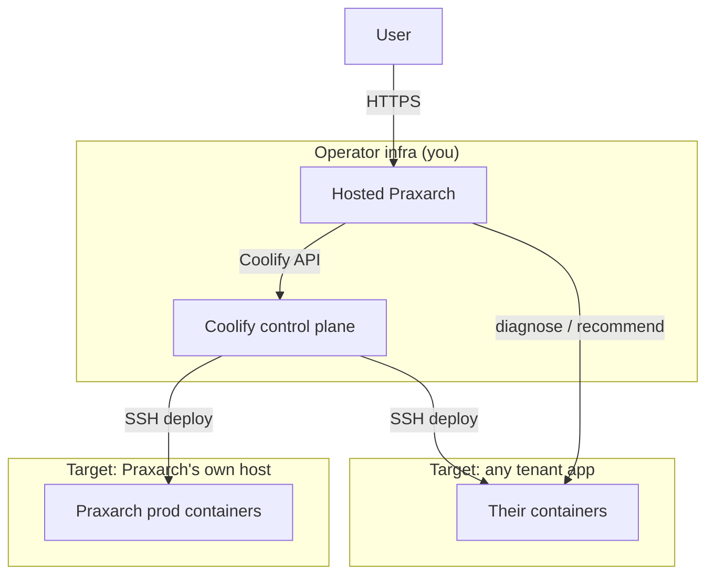

# 12 — Hosting Praxarch on AWS

How to run **Praxarch itself** as a hosted control plane, and how it deploys
targets (including itself) once hosted. Written so that **everything up to the
AWS boundary is done now** and the AWS steps are a turnkey checklist for later.

> Companion to [10-coolify-setup-guide.md](10-coolify-setup-guide.md) (wire a target app)
> and [11-coolify-provisioning-plan.md](11-coolify-provisioning-plan.md) (Gate 1.5 provisioning).
> Current: API v0.8.36 · Web v0.16.29.

> **STATUS — Phase 0 COMPLETE ✅ (2026-07-09).** All no-AWS readiness work is done
> and verified locally (prod images build; `/health` responds). Nothing further to
> do until you are ready to host. **Resume at [Phase 1 — Operator Coolify](#phase-1--operator-coolify-)** — the AWS/Coolify steps are a paste-in-values checklist from there.

---

## 0. Product boundary (read first)

Praxarch is a **control plane**. It does not build images itself in production
and it does not own tenant hosting.

| Layer | Owner | Praxarch's role |
|---|---|---|
| **Praxarch app** (web + api + postgres + redis) | Platform operator (you) | Runs here — this doc |
| **Coolify control plane** | Platform operator | Praxarch calls its API; tenants never see it |
| **Target servers** (Bubblbook, customer apps, Praxarch's own host) | Tenant / their ops | Praxarch diagnoses, recommends, and (if wired) triggers deploys |

**Targets do not need Coolify on their own infra.** A target needs only:
Docker + SSH reachable from the operator Coolify, a Git repo, and whatever
public ports the app itself requires. Coolify lives on operator infra.

---

## 1. Deploy models



| Model | Supported | Notes |
|---|---|---|
| **Local Praxarch → deploy hosted Praxarch** | ✅ Designed path | Recommended first bootstrap + dogfood |
| **Hosted Praxarch → redeploy itself** | ✅ | Redeploy/rolling; keep break-glass for full rebuild |
| **Hosted Praxarch → first bootstrap of itself** | ❌ | Chicken-and-egg; use local/CI/script once |
| **Praxarch → deploy any tenant app** | ✅ | Same wizard; per-target `deploy_profile_options` |

---

## 2. Readiness ledger — done now vs needs AWS

### ✅ Done now (no AWS, in this repo)

| Item | Artifact |
|---|---|
| Production stack (no bind mounts, no docker.sock, no repo mount) | `docker-compose.prod.yml` |
| TLS reverse proxy | `infra/caddy/Caddyfile` |
| Hosted env template | `.env.production.example` |
| Liveness probe (no tenant/auth) | `GET /health` → `apps/api/src/health/health.controller.ts` |
| Version single-source | `apps/api/src/version.ts` |
| First-boot / break-glass installer | `scripts/bootstrap-praxarch-host.sh` |
| Self-deploy target seed (template) | `scripts/seed-praxarch-self-deploy.sql` |
| Remote-first ECR build for hosted deploys | `apps/api/src/cicd/ecr-release.service.ts` |
| Prod images build locally | `docker compose -f docker-compose.prod.yml build` (verified) |

### 🔒 Needs AWS / operator Coolify (do at host time)

| Item | Why it can't be done now |
|---|---|
| EC2 instance + EBS + Elastic IP | Creates AWS resources |
| Route53 record / DNS | Points at a real IP |
| Operator Coolify install + API token | Runs on a real server |
| `COOLIFY_*` real values in `.env` | Depend on the Coolify instance |
| Coolify server/project/app UUIDs | Only exist after provisioning |
| Fill `seed-praxarch-self-deploy.sql` UUIDs | Depend on the above |
| Security-group rules (SSH/443 allowlists) | AWS-side networking |
| TLS certs (Let's Encrypt) | Need public DNS + reachable host |

**Bottom line:** the repo is host-ready. The only remaining work is provisioning
AWS + Coolify and pasting the resulting values into `.env` (and the seed row).

---

## 3. Recommended AWS setup

| Resource | Spec | ~Monthly (USD) |
|---|---|---|
| EC2 (Praxarch) | `t4g.small` (2 GB, ARM), Ubuntu 24.04, eu-west-1 | ~12 |
| EBS | 30 GB gp3 | ~2 |
| Elastic IP | attached to running instance | 0 |
| Route53 | 1 hosted zone | ~0.50 |
| Coolify control plane | Coolify Cloud **or** same/adjacent small instance | 0–6 |
| Data transfer | light control-plane traffic | ~1–3 |
| TLS (Caddy + Let's Encrypt) | in-stack | 0 |
| **Incremental total** | | **~$16–24/mo** |

Notes:
- **Skip ALB** — Caddy in the stack terminates TLS on the instance (saves ~$16/mo).
- **Skip RDS** — containerised Postgres is enough for a control plane (add RDS only if you outgrow it).
- **Skip n8n** on the hosted instance initially (not needed for deploys; saves RAM).
- If RAM is tight running Coolify on the same box, use **Coolify Cloud (~$5/mo)** or a separate `t4g.micro`.

---

## 4. Phased plan

### Phase 0 — Hosted-ready code ✅ COMPLETE (2026-07-09)
All artifacts in §2 exist and are verified locally: prod images build (both
`praxarch-api` and `praxarch-web`, exit 0) and `GET /health` responds with the
build version. **No remaining Phase 0 work — pick up at Phase 1 when hosting.**
Re-verify the build anytime:
```bash
docker compose -f docker-compose.prod.yml build
```

### Phase 1 — Operator Coolify 🔒
Choose one (operator-owned, not per tenant):
- **Coolify Cloud** — fastest; grab API URL + token.
- **Self-hosted** — `curl -fsSL https://cdn.coollabs.io/coolify/install.sh | bash` on a server.

Then: create an API token, and add a **Notifications → Webhook** pointing at
`https://<praxarch-domain>/cicd/webhooks/coolify`.

### Phase 2 — AWS host 🔒
1. Launch `t4g.small`, Ubuntu 24.04, 30 GB gp3, eu-west-1.
2. Allocate + attach an Elastic IP.
3. Security group inbound: `443` (public or allowlist), `22` (your IP only). Outbound: all.
4. Route53: `praxarch.<domain>` → Elastic IP.

### Phase 3 — Bootstrap (first boot) 🔒 — **do NOT use hosted Praxarch for this**
```bash
ssh ubuntu@<eip>
git clone <repo> praxarch && cd praxarch
cp .env.production.example .env
# edit .env: PRAXARCH_DOMAIN, CORS_ORIGINS, POSTGRES_PASSWORD,
#            SECRETS_ENC_KEY, COOLIFY_API_URL, COOLIFY_API_TOKEN
sudo bash scripts/bootstrap-praxarch-host.sh
```
Smoke test: `curl -s https://praxarch.<domain>/health` → `{"status":"ok",...}`
and the UI loads. Migrate any tenant data / secrets from local if needed
(`deploy_targets`, `tenant_secrets`).

### Phase 4 — Dogfood: local Praxarch deploys the hosted one 🔒
1. In **local** Praxarch, register the EC2 in operator Coolify (Add Deployment wizard).
2. Repo = Praxarch, build pack = `dockercompose`, compose = `docker-compose.prod.yml`, profile = `coolify`.
3. Deploy from local → validates the full wizard + Coolify path end to end.
4. Optionally fill `scripts/seed-praxarch-self-deploy.sql` (or let the wizard persist the row).
5. Thereafter: click Deploy from the **hosted** Praxarch for updates (redeploy).

### Phase 5 — General targets (any tenant app) 🔒
Same wizard, no Praxarch-specific assumptions:
1. Tenant adds repo + server IP + SSH key (stored in Coolify via Praxarch).
2. Praxarch preflight scans the server read-only; reports conflicts.
3. Praxarch provisions the Coolify app; syncs env from the vault.
4. Deploy / promote from UI (per-target `deploy_profile_options` for ECR, volume pins, etc.).

### Phase 6 — Hardening (later) 🔒
- Gate 7 auth (Cognito / external JWT) — retire `AUTH_PROVIDER=none`; until then restrict `443` by IP/VPN.
- GitHub Actions for image builds → removes dependency on any one build server (`ecrSkipBuild: true`).
- DB backups: `pg_dump` cron → S3.
- Break-glass documented: `git pull && docker compose -f docker-compose.prod.yml up -d --build`.

---

## 5. Hosted environment variables

From `.env.production.example`:

| Var | Purpose | Set when |
|---|---|---|
| `PRAXARCH_DOMAIN` | Public domain (Caddy + TLS) | Phase 3 |
| `CORS_ORIGINS` | Browser origin allowlist | Phase 3 |
| `POSTGRES_PASSWORD` | DB password | Phase 3 |
| `SECRETS_ENC_KEY` | Encrypt tenant secrets at rest (32+ chars) | Phase 3 |
| `DEPLOY_DRIVER=coolify` | Use real Coolify (not simulate) | Phase 3 |
| `COOLIFY_API_URL` / `COOLIFY_API_TOKEN` | Operator Coolify | Phase 1→3 |
| `COOLIFY_WEBHOOK_SECRET` | Verify status webhooks | Phase 1→3 |
| `PUBLIC_WEBHOOK_BASE` | Public URL vendors call back | Phase 3 |
| `AUTH_PROVIDER` | `none` until Gate 7 | Phase 6 |

**Not set in hosted:** `BUBBLBOOK_REPO_HOST_PATH`, `AWS_*`, docker.sock — these
are local-dev-only conveniences. Hosted Praxarch reaches build servers via SSH.

---

## 6. What stays local

`docker-compose.yml` (dev) is unchanged: hot reload, optional repo mount, and
docker.sock for local one-button ECR builds. Local and hosted are independent
compose files sharing the same `infra/postgres/init` schema.
